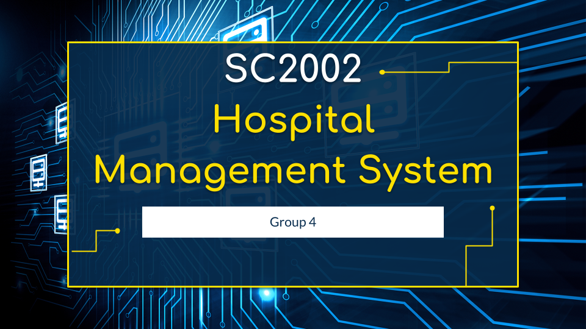

# Hospital Management System




## Table of Content
- [Compile Instructions](#compile-instructions)
- [Testing the Application](#testing-the-application)
- [Printing Information](#printing-information)
- [Folder/File Structure](#folderfile-structure)

## Compile Instructions
For Windows:
```
./compile
```

For Linux/Mac:
Compile.sh needs to be given executable permissions first. You can do that by:
```bash
chmod +x compile.sh
```
Then to run:
```bash
./compile.sh
```

## Testing the Application

### Login Credentials

Upon first run, use the following default login credentials:

	•	Administrator:
	•	User ID: admin
	•	Password: password (you will be prompted to change it upon first login)
	•	Doctor:
	•	User ID: doc1
	•	Password: password (change upon first login)
	•	Pharmacist:
	•	User ID: pharm1
	•	Password: password (change upon first login)
	•	Patient:
	•	User ID: patient1
	•	Password: password (change upon first login)

### Printing information

Use the following:
```bash
java -jar jdeserialize-1.2.jar src/database/users.ser
```
## Folder/File Structure:

- 📁[Report](/Report): Holds the group report
- 📁[controllers](/controllers): Contains the controller classes
- 📁[docs](/docs): Contains JAVADOC
- 📁[main](/main): Contains SystemIntializer and HMSapplication
- 📁[models](/models): Contains the model files
- 📁[src/database](/src/database): Contains .ser files for database
- 📁[utils](/utils): Contains configuration, serialization and password utility functions
- 📁[views](/views): Contains all the views for different users

